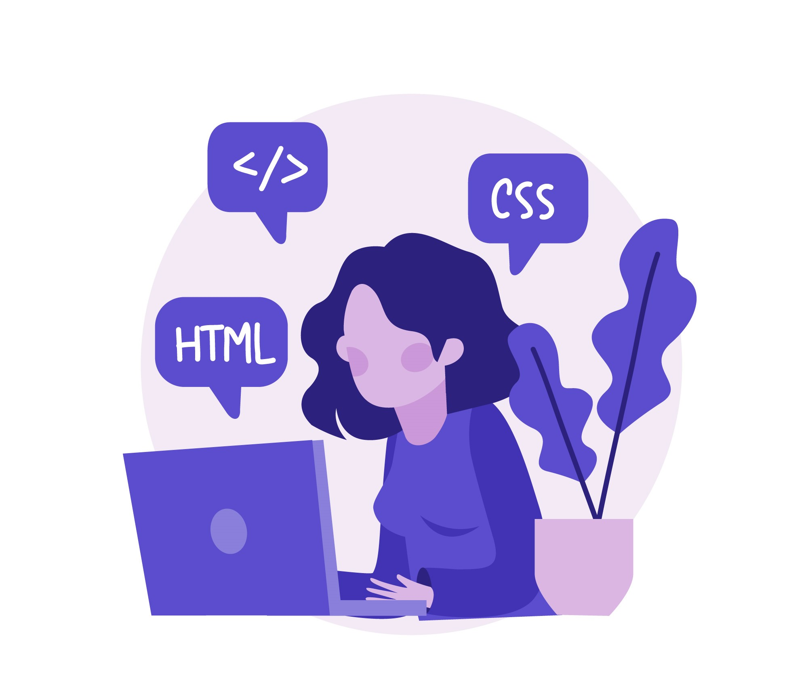

<h1>Hi There! 👋</h1>

## My name is Ian Thomas
(React JS | Next JS | Angular  | Javascript | HTML | CSS | Typescript | Java | Spring Boot ) 🚀
- 👩‍💻 Software Enginner
- 🎓 ADS Science Student
- 🌐 Passionate about web development
- 💡 Love a good challenge

  

  
 
